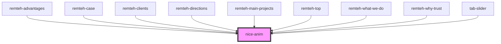

# nice-anim

<!-- Auto Generated Below -->

## Dependencies

### Used by

 - [remteh-advantages](../remteh-advantages)
 - [remteh-case](../remteh-case)
 - [remteh-clients](../remteh-clients)
 - [remteh-directions](../remteh-directions)
 - [remteh-main-projects](../remteh-main-projects)
 - [remteh-top](../remteh-top)
 - [remteh-what-we-do](../remteh-what-we-do)
 - [remteh-why-trust](../remteh-why-trust)
 - [tab-slider](../tab-slider)

### Graph

----------------------------------------------

