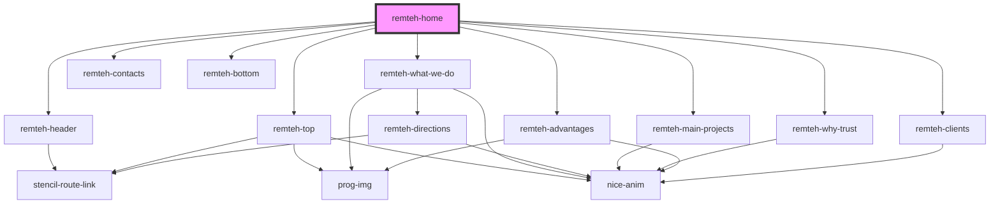

# remteh-home

<!-- Auto Generated Below -->

## Dependencies

### Depends on

- [remteh-header](../remteh-header)
- [remteh-top](../remteh-top)
- [remteh-what-we-do](../remteh-what-we-do)
- [remteh-main-projects](../remteh-main-projects)
- [remteh-why-trust](../remteh-why-trust)
- [remteh-advantages](../remteh-advantages)
- [remteh-clients](../remteh-clients)
- [remteh-contacts](../remteh-contacts)
- [remteh-bottom](../remteh-bottom)

### Graph

----------------------------------------------

