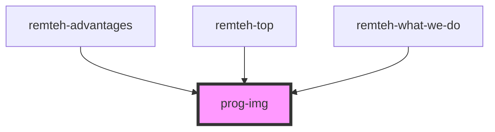

# prog-img

<!-- Auto Generated Below -->

## Properties

| Property      | Attribute      | Description | Type     | Default     |
| ------------- | -------------- | ----------- | -------- | ----------- |
| `class`       | `class`        |             | `string` | `undefined` |
| `placeHolder` | `place-holder` |             | `string` | `undefined` |
| `src`         | `src`          |             | `string` | `undefined` |

## Dependencies

### Used by

 - [remteh-advantages](../remteh-advantages)
 - [remteh-top](../remteh-top)
 - [remteh-what-we-do](../remteh-what-we-do)

### Graph

----------------------------------------------

