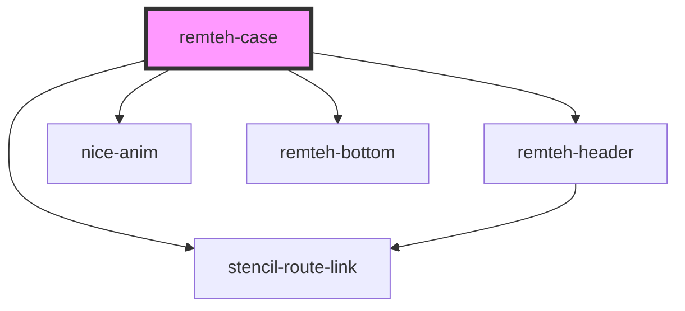

# remteh-case

<!-- Auto Generated Below -->

## Properties

| Property | Attribute | Description | Type     | Default     |
| -------- | --------- | ----------- | -------- | ----------- |
| `case`   | `case`    |             | `string` | `undefined` |

## Dependencies

### Depends on

- [remteh-header](../remteh-header)
- [nice-anim](../anim)
- stencil-route-link
- [remteh-bottom](../remteh-bottom)

### Graph

----------------------------------------------

