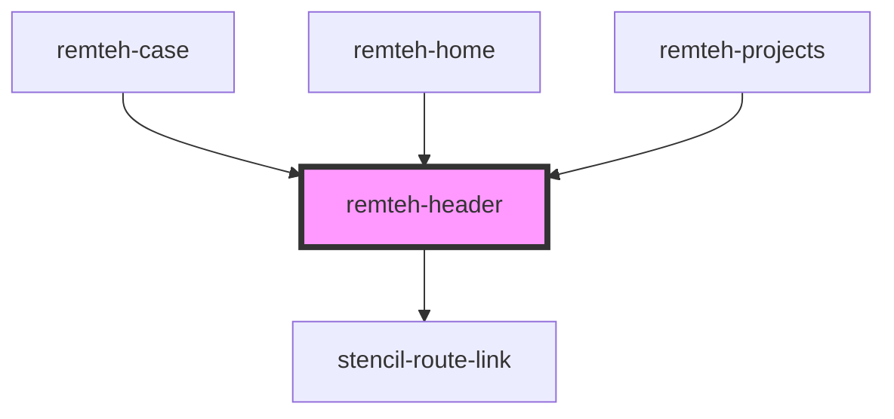

# remteh-header

<!-- Auto Generated Below -->

## Properties

| Property | Attribute | Description | Type                             | Default     |
| -------- | --------- | ----------- | -------------------------------- | ----------- |
| `mode`   | `mode`    |             | `"Case" or "Home" or "Projects"` | `undefined` |

## Dependencies

### Used by

 - [remteh-case](../remteh-case)
 - [remteh-home](../home)
 - [remteh-projects](../projects)

### Depends on

- stencil-route-link

### Graph

----------------------------------------------

