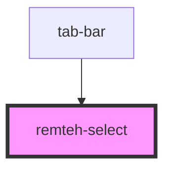

# remteh-select

<!-- Auto Generated Below -->

## Properties

| Property         | Attribute         | Description | Type                                            | Default     |
| ---------------- | ----------------- | ----------- | ----------------------------------------------- | ----------- |
| `onSelect`       | --                |             | `(value: IFilters) => void`                     | `undefined` |
| `options`        | --                |             | `IFilters[]`                                    | `undefined` |
| `selectedOption` | `selected-option` |             | `"All" \| "Civil" \| "Foreign" \| "Industrial"` | `undefined` |

## Dependencies

### Used by

 - [tab-bar](../tab-slider)

### Graph

----------------------------------------------

