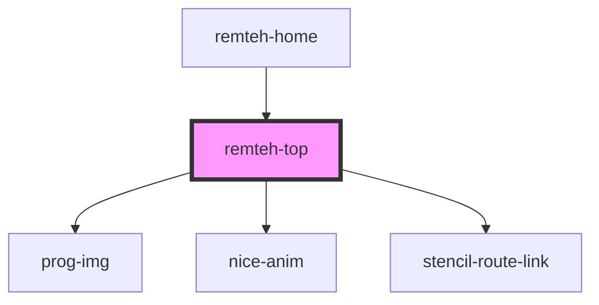

# remteh-top

<!-- Auto Generated Below -->

## Properties

| Property | Attribute | Description | Type     | Default     |
| -------- | --------- | ----------- | -------- | ----------- |
| `class`  | `class`   |             | `string` | `undefined` |

## Dependencies

### Used by

 - [remteh-home](../home)

### Depends on

- [prog-img](../img)
- [nice-anim](../anim)
- stencil-route-link

### Graph

----------------------------------------------

