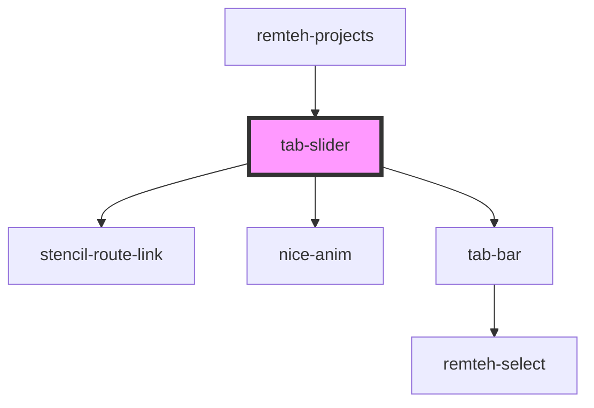

# tab-slider

<!-- Auto Generated Below -->

## Properties

| Property | Attribute | Description | Type           | Default     |
| -------- | --------- | ----------- | -------------- | ----------- |
| `slides` | --        |             | `ISlideFilter` | `undefined` |
| `tabs`   | --        |             | `IFilters[]`   | `undefined` |

## Dependencies

### Used by

 - [remteh-projects](../projects)

### Depends on

- stencil-route-link
- [nice-anim](../anim)
- [tab-bar]()

### Graph

----------------------------------------------

